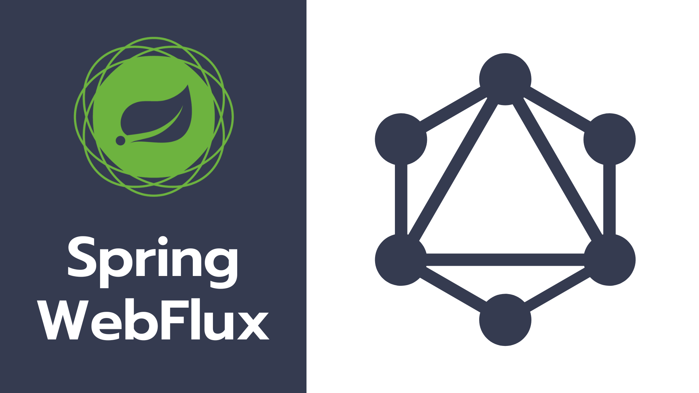

# GraphQL With Spring Webflux

This repo contains the source code for the application developed in [this course](https://www.udemy.com/course/graphql-spring).

This is the 6th course in the Reactive Course Series. Spring WebFlux is a reactive non-blocking web stack which scales better & provides better performance compared to traditional Spring Web MVC! In this course, we learn GraphQL From Scratch with Spring WebFlux to build Reactive Microservices.

By the end of this course you would be comfortable with:

## GraphQL Query

- How GraphQL works behind the scenes
- Exposing APIs & Passing Arguments
- Sequential vs Parallel execution of the APIs
- Type System - various GraphQL types and how to create your own types
- Scalars / Objects
- Interface / Union - For better API design
- Schema Design - How to create types for your application and expose your APIs
- N + 1 Problem and Possible solutions

## How To Structure GraphQL Queries
- Various GraphQL Clients - How to call your GraphQL APIs
- Field Alias to change the response labels
- Fragments for better reuse in the GraphQL Query Document
- Operation Names for better debugging
- Directives @Include / @Skip / @Deprecated for conditionally executing the APIs

## Advanced Concepts
- Custom Data Fetcher - How to create your own data resolver for fetching the data more efficiently.
- Data Fetching Selection Set - How to access various fields from the request
- Operation Caching - to speed up the GraphQL engine execution by caching the parsed document.

## CRUD Applications With GraphQL

- Integration with Database to create a CRUD application and learn how GraphQL Mutation works.

## Subscription

- Let's learn how GraphQL Subscription works for a long running stream of responses using WebFlux WebSocket.
- How to emit events for the clients to consume.

## Input Validation / Error Handling

- How we could do input validation and communicate the error messages to the client. There are few techniques like GraphQL Error object, Using Union types etc. We will be exploring all the options. 
- How we could intercept the incoming requests, access HTTP headers and pass them to the GraphQL controller / APIs and take appropriate actions.

## Integration Tests

- How to write integration tests for your GraphQL API and do the assertion using JSON Path. This covers Query / Mutation and Subscription type APIs.

